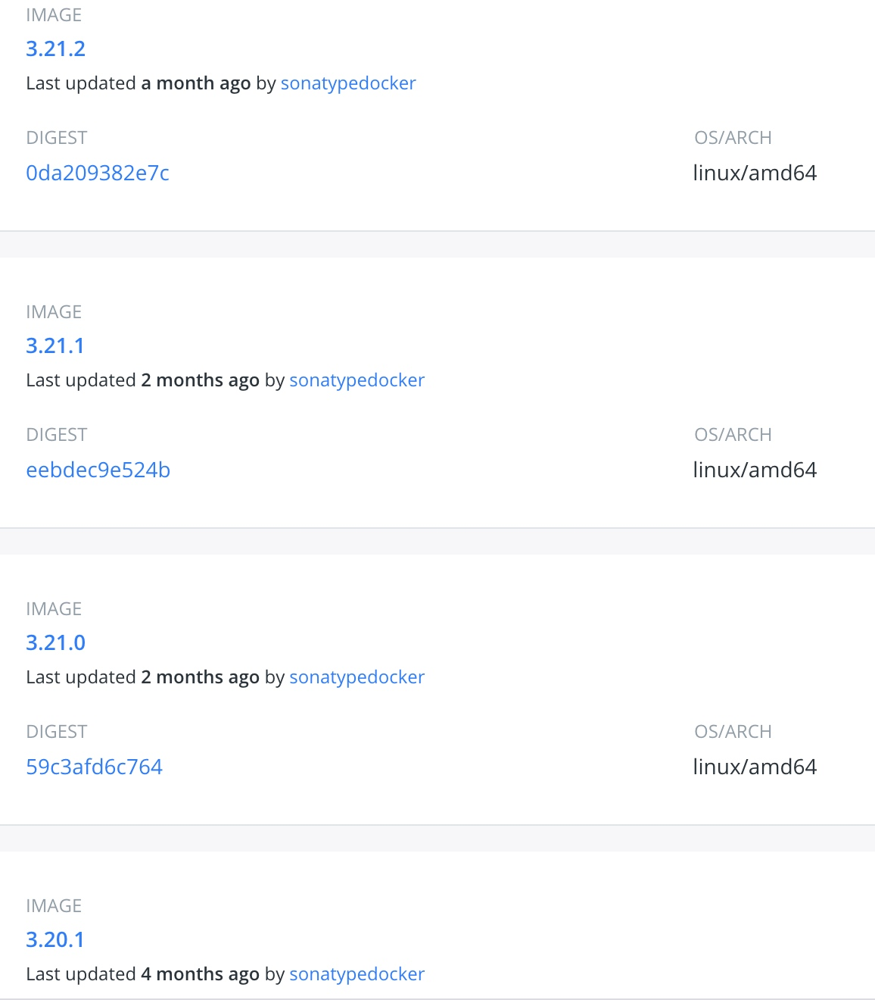
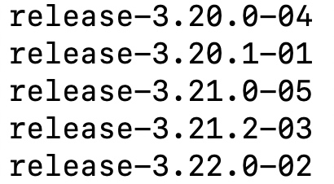
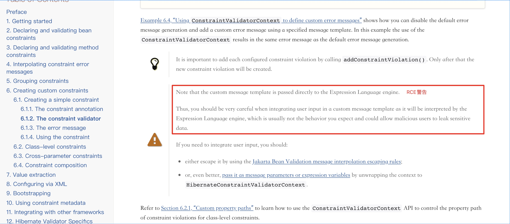
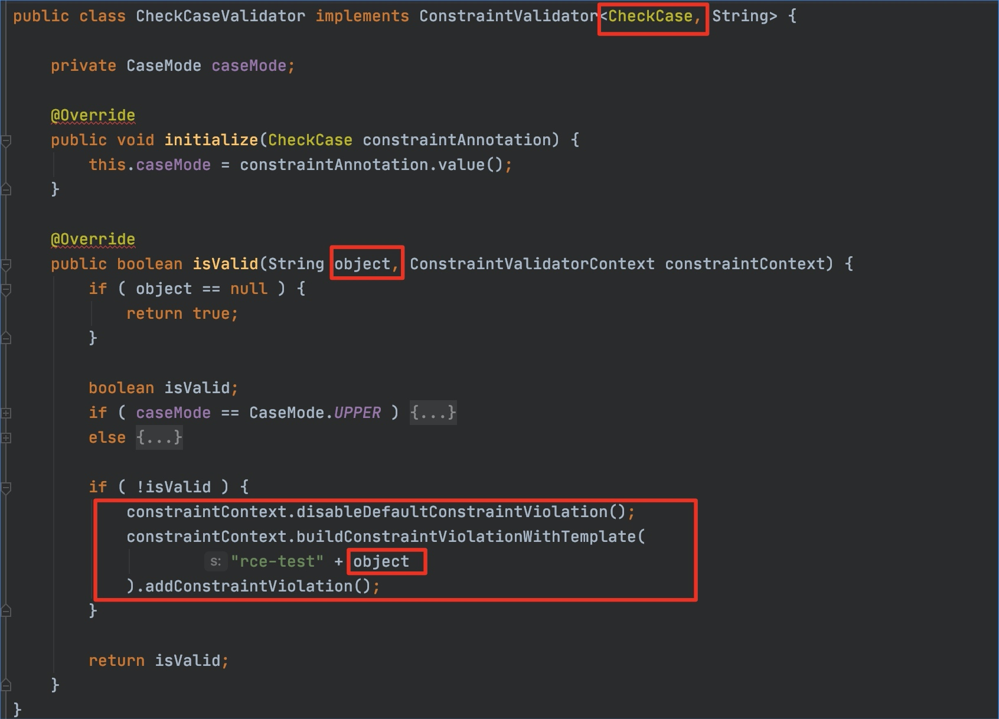
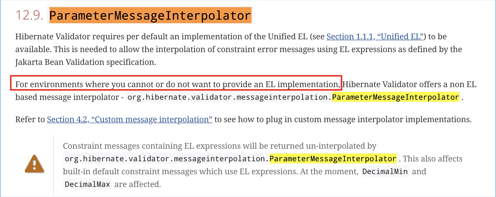
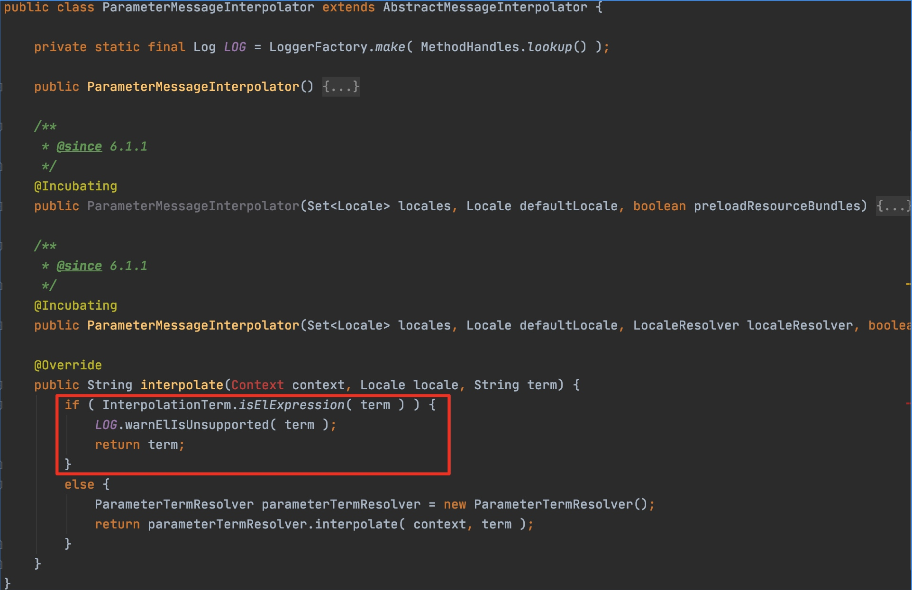
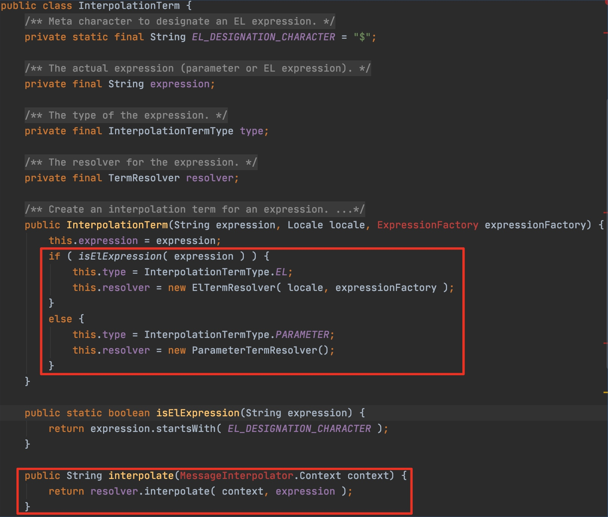
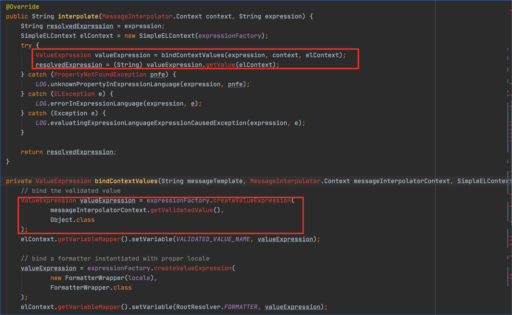
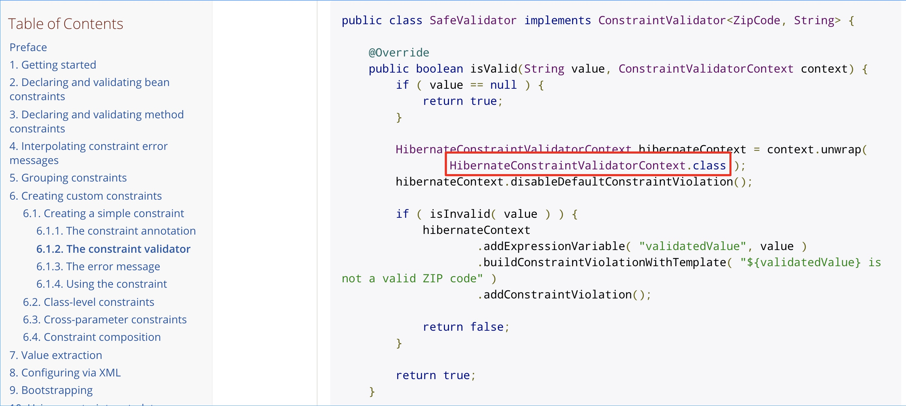

# cve-2020-10199/10204事件调查

## 参考
https://securitylab.github.com/advisories/GHSL-2020-011-nxrm-sonatype
https://securitylab.github.com/advisories/GHSL-2020-012-nxrm-sonatype
https://securitylab.github.com/advisories/GHSL-2020-013-nxrm-sonatype
https://securitylab.github.com/advisories/GHSL-2020-014-nxrm-sonatype
https://securitylab.github.com/advisories/GHSL-2020-015-nxrm-sonatype

## 概述
cve-2020-10199/10204是安全研究员在开源产品 Nexus OSS 中发现的两个rce漏洞，其中：
1. cve-2020-10204，需要管理员权限；
2. cve-2020-10199，需要普通用户权限；
3. 以及若干未分配编号的漏洞，需要不同级别的权限

这些漏洞都是由于未合适地过滤用户输入，导致EL表达式执行，从而造成rce。漏洞最新修复版本是3.21.2。
docker hub中的时间线与版本：

git hub的时间线与版本：


## 漏洞成因
简单来说，Nexus OSS 因为使用了 hibernate-validator 的自定义约束违反消息机制，没有过滤好用户输入，导致用户可控数据流拼接到消息参数，最终造成rce。
hibernate-validator官网其实有提到这个点

具体到代码中是如何体现的呢，通过本地测试，不考虑特殊情况（什么是特殊情况稍后再讲），我总结的可能产生问题的代码如下所示
```
ConstraintValidatorContext#disableDefaultConstraintViolation();
ConstraintValidatorContext#buildConstraintViolationWithTemplate(用户输入拼接)
```

object参数是被校验的值，所以它必须是String或者包含String的复杂类型，比如Iterator、List等，并且污点数据流需要进入buildConstraintViolationWithTemplate的参数数据流中。

## 修复
修复版本是3.21.2，首先看看修复前后 Bootstrap Validator 的对比。

修复前：release-3.20.1-01

修复后：release-3.21.2-03

这是个啥东西呢，看看官方文档的解释，明确说了不提供el表达式解析。

具体到代码里是怎么实现的呢，在`ParameterMessageInterpolator`的`interpolate`方法里，首先会对传过来的表达式参数字符串做一个检查，如果是EL表达式，直接返回，不解析。

判断字符串是否是EL表达式的方法就是看字符串是否以$开头。

对比看下`AbstractMessageInterpolator`另外一个子类的interpolate方法就很直观了，没做任何判断，直接解析。如果想达到rce，必须控制调用流到这里。

不做判断，继续调用

到这里就能看到`createValueExpression + getValue`

用`ParameterMessageInterpolator`就是前文提到的特殊情况，在用ParameterMessageInterpolator初始化了ValidatorFacotry后，即使拼接了用户输入到buildConstraintViolationWithTemplate的参数中，也不会造成rce。但这还不是官方建议的防注入方式，官方建议使用HibernateConstraintValidatorContext来避免注入

另外根据官方文档，`ResourceBundleMessageInterpolator`（前文提到的`AbstractMessageInterpolator`另外一个子类）是 Hibernate-Validator 的默认消息插入器，即如果不在Bootstrap Validator时指定ParameterMessageInterpolator，一旦消息参数中拼接了用户输入流，就会造成rce。

